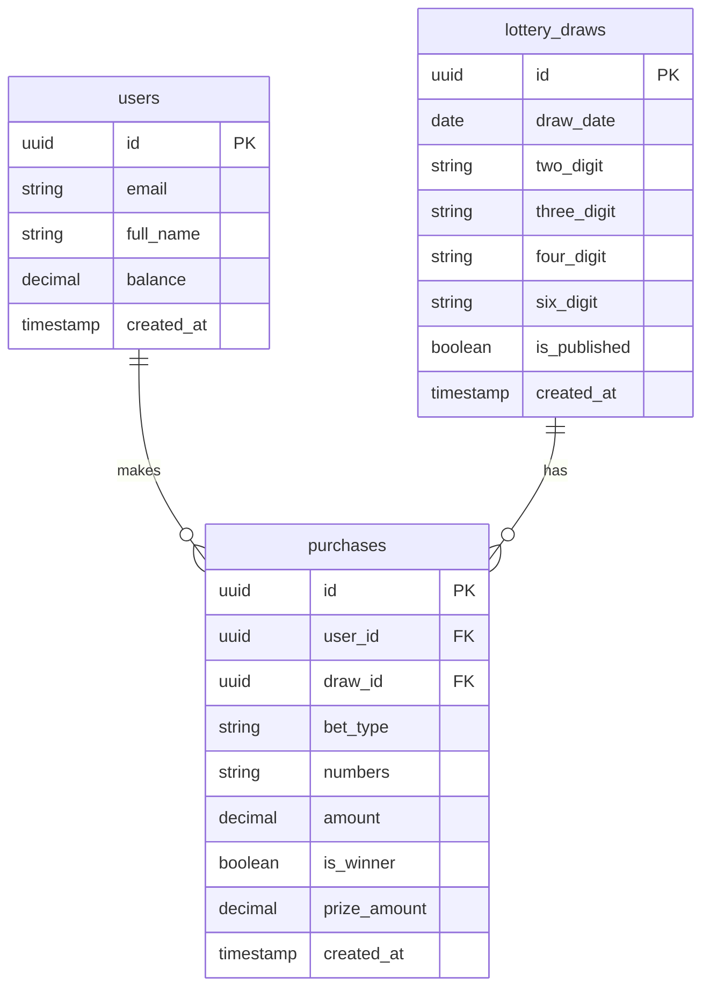

# Lao Lottery App - Implementation Plan

สร้างแอปพลิเคชันหวยลาวโดยใช้ **Vite + React + Supabase** ที่มีระบบสมาชิก, ซื้อหวย, และตรวจผลรางวัล

## User Review Required

> [!IMPORTANT]
> **Supabase Project Required**
> คุณจะต้องสร้าง Supabase Project ก่อนที่จะใช้งานได้ โปรดไปที่ [supabase.com](https://supabase.com) เพื่อสร้างโปรเจ็คใหม่และรับ:
> - `VITE_SUPABASE_URL` - URL ของโปรเจ็ค Supabase
> - `VITE_SUPABASE_ANON_KEY` - Anon Key สำหรับเชื่อมต่อ

---

## Proposed Features

### 🎰 ฟีเจอร์หลัก
1. **ระบบสมาชิก** - สมัครสมาชิก/เข้าสู่ระบบ ด้วย Email
2. **ซื้อหวย** - เลือกเลข 2 ตัว, 3 ตัว, 4 ตัว และ 6 ตัว (หวยลาว)
3. **ตรวจผลรางวัล** - ดูผลหวยงวดล่าสุดและงวดก่อนหน้า
4. **ประวัติการซื้อ** - ดูรายการหวยที่เคยซื้อทั้งหมด
5. **Dashboard Admin** - จัดการผลหวยและดูรายงาน

---

## Proposed Changes

### Project Setup

#### [NEW] .env
Environment variables สำหรับ Supabase connection

#### [NEW] vite.config.js
Vite configuration with React plugin

---

### Supabase Client

#### [NEW] src/lib/supabase.js
Supabase client initialization

---

### Core Components

#### [NEW] src/App.jsx
Main app component with routing

#### [NEW] src/components/Navbar.jsx
Navigation bar with auth state

#### [NEW] src/components/LotteryCard.jsx
หวย Card component for displaying lottery options

---

### Pages

#### [NEW] src/pages/Home.jsx
Landing page with latest results and buy options

#### [NEW] src/pages/Login.jsx
Login/Register page

#### [NEW] src/pages/BuyLottery.jsx
ซื้อหวย - select numbers and place bets

#### [NEW] src/pages/Results.jsx
ผลหวย - View lottery results

#### [NEW] src/pages/History.jsx
ประวัติการซื้อ - User's purchase history

---

### Styling

#### [NEW] src/index.css
Global styles with design system:
- Dark theme with golden accents (ธีมหวยลาว)
- CSS variables for consistency
- Responsive design
- Smooth animations

---

## Database Schema



---

## Verification Plan

### Development Server
```bash
npm run dev
```
- ทดสอบการแสดงผลหน้าแรก
- ทดสอบ responsive design
- ทดสอบ navigation

### Supabase Integration
- ทดสอบ login/register
- ทดสอบการบันทึกข้อมูลหวย
- ทดสอบการดึงผลหวย

### Browser Testing
- ทดสอบใน Chrome และ Mobile view
- ตรวจสอบ UI/UX และ animations
