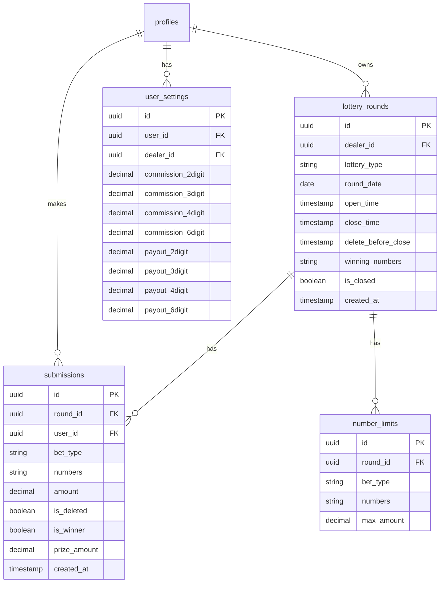

# Lao Lottery App - Implementation Plan v2

ปรับปรุง Dashboard สำหรับระบบหวยลาว แบ่งตาม 3 บทบาท

---

## 📌 สรุป Requirements

### 1. SuperAdmin Dashboard
| ฟีเจอร์ | รายละเอียด |
|--------|-----------|
| ภาพรวมเจ้ามือ | จำนวนเจ้ามือ, จำนวน user แต่ละคน |
| ดูข้อมูลเจ้ามือ | คลิกเข้าไปดูรายละเอียดของแต่ละ dealer |
| ดูข้อมูล User | ดูการส่งเลขของแต่ละ user |
| ดูงวดที่เปิดรับ | เห็นว่า dealer กำลังเปิดรับหวยอะไรบ้าง |
| มุมมอง Dealer | สามารถเข้าไปดู dashboard แบบ dealer ได้ |

---

### 2. Dealer Dashboard
| ฟีเจอร์ | รายละเอียด |
|--------|-----------|
| เชิญ User | QR Code + ลิงก์รับสมาชิก ✅ มีแล้ว |
| สร้างงวดหวย | กำหนดวันที่, เวลาเปิด-ปิดรับ |
| ตั้งค่าคอม | กำหนด commission rate ให้แต่ละ user |
| ตั้งอัตราจ่าย | กำหนด payout rate ให้แต่ละ user |
| ดูเลขที่ส่งมา | ภาพรวม + รายละเอียด |
| ตั้งค่าอั้น | กำหนดว่าแต่ละเลขรับได้ไม่เกินเท่าไหร่ |
| ดูเลขเกิน | แสดงเลขที่เกินค่าอั้น |
| ตรวจผลรางวัล | ใส่เลขที่ออก → คำนวณผู้ชนะอัตโนมัติ |
| ปิดงวด | ปิดงวดเมื่อจบ |

---

### 3. User Dashboard  
| ฟีเจอร์ | รายละเอียด |
|--------|-----------|
| ดูงวดเปิดรับ | เห็นประเภทหวย + เวลาเปิด-ปิด |
| ส่งเลข | ป้อนเลขที่ขายมา → ส่งให้ dealer |
| ลบเลข | ลบได้ภายในเวลาที่ dealer กำหนด |
| ดูเลขที่ส่ง | รายการเลขทั้งหมดที่ส่งไป |
| ดูค่าคอม | เห็น commission rate + คอมรวม |
| ดูผลรางวัล | เลขที่ถูก + สรุปต้องจ่าย/ได้รับ |

---

## 💡 ข้อเสนอแนะเพิ่มเติม

1. **🔔 ระบบแจ้งเตือน** - แจ้งเมื่องวดเปิด/ปิด, หวยออก
2. **📊 รายงานสรุป** - Export PDF/Excel สำหรับ dealer
3. **💰 ประวัติเงิน** - บันทึกการจ่าย/รับเงินระหว่าง user-dealer
4. **⏰ Timer แสดงเวลา** - Countdown ก่อนปิดรับ
5. **📱 Mobile-first** - ออกแบบให้ใช้งานมือถือได้ดี

---

## 🗄️ Database Changes Required

---

## 🔄 Implementation Order

### Phase 1: Database & Core
- [ ] สร้าง SQL migration ใหม่
- [ ] อัปเดต Supabase schema

### Phase 2: Dealer Dashboard
- [ ] สร้างงวดหวย
- [ ] ตั้งค่าคอม + อัตราจ่าย
- [ ] ตั้งค่าอั้น
- [ ] ดูเลขที่ส่งมา
- [ ] ตรวจผลรางวัล

### Phase 3: User Dashboard
- [ ] ดูงวดที่เปิดรับ
- [ ] ส่งเลข + ลบเลข
- [ ] ดูค่าคอม
- [ ] ดูผลรางวัล

### Phase 4: SuperAdmin Dashboard
- [ ] ภาพรวมเจ้ามือ
- [ ] ดูข้อมูล dealer/user
- [ ] มุมมอง dealer
