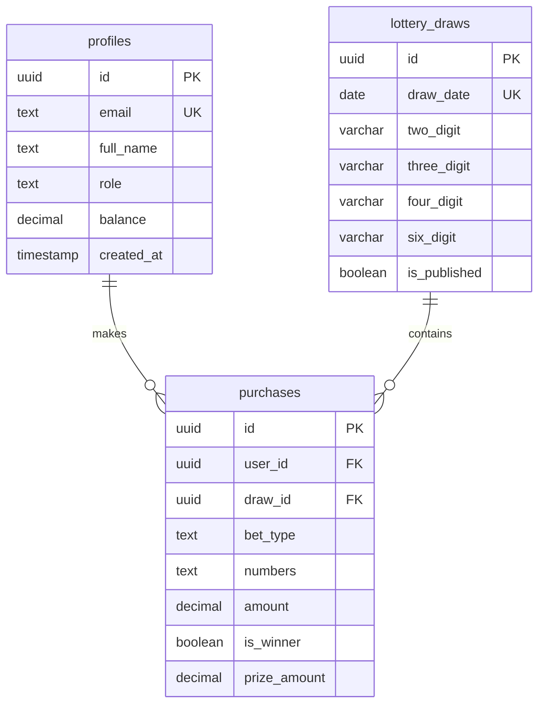

# หวยลาว (Lao Lotto) - Walkthrough

แอปพลิเคชันหวยลาวออนไลน์ สร้างด้วย **Vite + React + Supabase** พร้อมระบบ 3 บทบาท

---

## ✅ สิ่งที่สร้างเสร็จแล้ว

### 🎯 ฟีเจอร์หลัก
| ฟีเจอร์ | รายละเอียด |
|--------|-----------|
| ระบบสมาชิก | Login, Register ด้วย Email |
| ซื้อหวย | เลือกเลข 2, 3, 4, 6 ตัว พร้อมตะกร้า |
| ผลหวย | ดูผลหวยงวดล่าสุดและประวัติ |
| ประวัติการซื้อ | ดูรายการโพยทั้งหมดของผู้ใช้ |
| Dashboard เจ้ามือ | ดูโพยทั้งหมดในแต่ละงวด |
| Dashboard Admin | จัดการงวดหวย, สมาชิก, คำนวณผู้ชนะ |

### 👥 3 บทบาทผู้ใช้
1. **superadmin** - จัดการทุกอย่าง, เพิ่มงวดหวย, กำหนดสิทธิ์
2. **dealer (เจ้ามือ)** - ดูและจัดการโพยทั้งหมด
3. **user (ผู้ใช้)** - ซื้อหวย, ดูประวัติ

---

## 📁 โครงสร้างโปรเจ็ค

```
Lao_Lotto/
├── src/
│   ├── components/
│   │   ├── Navbar.jsx          # Navigation bar
│   │   ├── Navbar.css
│   │   ├── LotteryCard.jsx     # Lottery type card
│   │   └── LotteryCard.css
│   ├── contexts/
│   │   └── AuthContext.jsx     # Auth state management
│   ├── lib/
│   │   └── supabase.js         # Supabase client
│   ├── pages/
│   │   ├── Home.jsx/css        # Landing page
│   │   ├── Login.jsx           # Login page
│   │   ├── Register.jsx        # Register page
│   │   ├── Auth.css            # Auth pages styling
│   │   ├── BuyLottery.jsx/css  # Buy lottery page
│   │   ├── Results.jsx/css     # Results page
│   │   ├── History.jsx/css     # Purchase history
│   │   ├── Dealer.jsx/css      # Dealer dashboard
│   │   └── Admin.jsx/css       # Admin dashboard
│   ├── App.jsx                 # Main app with routing
│   ├── main.jsx                # Entry point
│   └── index.css               # Global styles
├── supabase/
│   └── migrations/
│       └── 001_initial_schema.sql  # Database schema
├── .env.example                # Environment template
└── index.html                  # HTML template
```

---

## 🗄️ Database Schema



---

## 🚀 การตั้งค่า Supabase

### 1. สร้างไฟล์ `.env`
```bash
VITE_SUPABASE_URL=your_supabase_url
VITE_SUPABASE_ANON_KEY=your_supabase_anon_key
```

### 2. รัน SQL Migration
ไปที่ Supabase Dashboard > SQL Editor และรัน:
- `supabase/migrations/001_initial_schema.sql`

### 3. เปิดใช้ Authentication
- ไปที่ Authentication > Providers
- เปิดใช้ Email provider
- ตั้งค่า Site URL และ Redirect URLs

---

## 🎨 Design System

| Token | ค่า |
|-------|-----|
| Primary | `#d4af37` (Gold) |
| Secondary | `#1a1a2e` (Dark) |
| Accent | `#e94560` (Red) |
| Success | `#00d26a` |
| Background | `#0f0f1a` |

### ฟอนต์
- **Prompt** (Thai) จาก Google Fonts

---

## 🔧 คำสั่งที่ใช้

```bash
# รัน development server
npm run dev

# Build production
npm run build
```

---

## ⚙️ อัตราการจ่าย

| ประเภท | อัตรา |
|--------|------|
| 2 ตัว | x90 |
| 3 ตัว | x500 |
| 4 ตัว | x5,000 |
| 6 ตัว | x100,000 |

---

## 📝 ขั้นตอนถัดไป

> [!TIP]
> สิ่งที่ต้องทำเพื่อใช้งานจริง:

1. **ตั้งค่า Supabase** - สร้างโปรเจ็คและรัน migration
2. **ตั้ง Admin แรก** - หลังสมัครสมาชิก ไปแก้ role เป็น `superadmin` ในตาราง profiles
3. **สร้างงวดหวย** - ใช้หน้า Admin เพิ่มงวดหวยใหม่
4. **ทดสอบระบบ** - ให้ผู้ใช้ทดลองซื้อหวย
